# Muhittin Efecan Türk

### Full-Stack Developer · Developer + Designer + Gamer + Creative

**Fikirleri kod, tasarım ve görsel anlatımla gerçeğe dönüştüren bir üniversite öğrencisi.**

<!-- ====================================================== -->
<!-- TEMA DESTEKLİ HERO                                     -->
<!-- ====================================================== -->
<picture>
  <source media="(prefers-color-scheme: dark)" srcset="./dark.svg">
  <source media="(prefers-color-scheme: light)" srcset="./light.svg">
  
</picture>

> **Profil görseli:** SVG içindeki `PROFİL GÖRSELİ ALANI` yorumunu bulup kendi görsel URL'ni ekleyebilirsin.

---

## 👨‍💻 Hakkımda

Ben **Muhittin Efecan Türk**. Full-Stack Development, Web Design, Graphic Design, Photography ve cinematic video production alanlarını bir araya getirerek fikirleri dijital ürünlere dönüştürmeyi seviyorum.

Kod yazarken yalnızca çalışan bir sistem değil; **iyi görünen, anlaşılır, kullanılabilir ve güçlü bir deneyim** oluşturmayı hedefliyorum.

- 🎓 Üniversite öğrencisi
- 💻 Full-Stack Developer
- 🎨 Designer & Creative Developer
- 🎬 Video Editor / Visual Creator
- 📷 Photography ile ilgileniyorum
- 🧠 Yeni teknolojiler ve araçlar deneyerek sürekli öğreniyorum
- 🚀 Fikir → Prototype → Development → Release sürecini seviyorum

---

## 🧩 Yetenek Alanlarım

### `YAZILIM`

`HTML` · `CSS` · `JavaScript` · `TypeScript` · `Python` · `React` · `Node.js` · `Flask` · `Three.js` · `Cloudflare Workers` · `Cloudflare D1` · `PostgreSQL` · `MongoDB` · `Git` · `GitHub` · `Docker`

### `TASARIM`

`Figma` · `Photoshop` · `Illustrator` · `UI/UX` · `Typography` · `Color Theory` · `Composition` · `Responsive Design` · `Minimalist / Modern Design`

### `GÖRSEL`

`Photography` · `Graphic Design` · `Photo Manipulation` · `Vector Design` · `Visual Storytelling` · `Branding` · `Motion Graphics`

### `VİDEO`

`Premiere Pro` · `After Effects` · `DaVinci Resolve` · `Video Editing` · `VFX` · `Color Grading` · `Sound Design` · `Music Sync` · `Cinematic Editing`

---

## 🚀 Öne Çıkan Projeler

> Aşağıdaki liste profilimdeki farklı geliştirme, design ve creative çalışmalarını tek yerde toplar. Linkleri eklemek için ilgili `TODO` yorumlarını kullanabilirsin.

### 01 — GEFOK WEB DESIGN
Gerze MYO Yaratıcı Topluluğu için hazırlanan modern corporate website. SEO odaklı yapı, CMS desteği ve responsive interface yaklaşımı.

<!-- TODO: GEFOK proje linkini buraya ekle -->

### 02 — Göktürk WEB DESIGN
Ürün odaklı, yüksek dönüşüm hedefleyen one-page landing page projesi.

<!-- TODO: Göktürk proje linkini buraya ekle -->

### 03 — Efecan Brain
Kişisel bilgi ve içerik işleme altyapısı. Verileri düzenleme, tekrarları temizleme, yapılandırma ve kişisel knowledge system oluşturma üzerine bir çalışma.

<!-- TODO: Efecan Brain repository linkini buraya ekle -->

### 04 — Kantin Sipariş Sistemi
Öğrenci, web arayüzü ve kantin yönetimi akışını bir araya getiren; ürünlerin config tabanlı yönetilebildiği ve Cloudflare D1 üzerinde veri işlemleri hedeflenen web uygulaması.

<!-- TODO: Kantin Sipariş Sistemi linkini buraya ekle -->

### 05 — Three.js Car Showroom
Three.js tabanlı interaktif car showroom deneyimi.

<!-- TODO: Car Showroom linkini buraya ekle -->

### 06 — Football Card Editor
Flask tabanlı football card düzenleme ve JSON veri yönetim sistemi.

<!-- TODO: Football Card Editor linkini buraya ekle -->

### 07 — Discord Tournament Bot
Turnuva süreçlerini otomatikleştirmek için geliştirilen Discord bot projesi.

<!-- TODO: Discord Bot linkini buraya ekle -->

### 08 — SVG → Layered PSD System
SVG dosyalarını katmanlı Photoshop PSD çıktısına dönüştürmeye yönelik automation pipeline.

<!-- TODO: SVG → PSD repository linkini buraya ekle -->

### 09 — Infographic Generator
Farklı infographic türlerini otomatik oluşturan SVG generator sistemi. KPI, comparison, pyramid, timeline, process, analytics, hub, matrix ve editorial formatlarını kapsayan yapı.

<!-- TODO: Infographic Generator linkini buraya ekle -->

### 10 — Gerze MYO Digital Transformation
Gerze MYO'nun dijital dönüşüm sürecini, varlık envanterini ve 2025–2027 hedeflerini görsel ve sunum odaklı bir yapıya dönüştüren çalışma.

<!-- TODO: Gerze MYO projesi linkini buraya ekle -->

---

## 🛠️ Teknoloji Stack'im

| Alan | Technologies |
|---|---|
| Frontend | HTML · CSS · JavaScript · TypeScript · React · Three.js |
| Backend | Node.js · Flask · Python |
| Database | Cloudflare D1 · PostgreSQL · MongoDB |
| Cloud / Infra | Cloudflare · Docker · Vercel · Git · GitHub |
| Design | Figma · Photoshop · Illustrator |
| Motion / Video | Premiere Pro · After Effects · DaVinci Resolve |

---

## 📊 GitHub İstatistikleri

<picture>
  <source media="(prefers-color-scheme: dark)" srcset="https://github-readme-streak-stats.herokuapp.com/?user=muhittinefecan-turk&theme=dark&hide_border=true&ring=00D9FF&fire=A855F7&currStreakLabel=00D9FF">
  <source media="(prefers-color-scheme: light)" srcset="https://github-readme-streak-stats.herokuapp.com/?user=muhittinefecan-turk&theme=default&hide_border=true&ring=0066FF&fire=A855F7&currStreakLabel=0066FF">
  
</picture>

  

<picture>
  <source media="(prefers-color-scheme: dark)" srcset="https://github-readme-stats-sigma-rosy-28.vercel.app/api?username=muhittinefecan-turk&show_icons=true&hide_border=true&theme=dark&title_color=00D9FF&icon_color=A855F7">
  <source media="(prefers-color-scheme: light)" srcset="https://github-readme-stats-sigma-rosy-28.vercel.app/api?username=muhittinefecan-turk&show_icons=true&hide_border=true&theme=default&title_color=0066FF&icon_color=A855F7">
  
</picture>

<picture>
  <source media="(prefers-color-scheme: dark)" srcset="https://github-readme-stats-sigma-rosy-28.vercel.app/api/top-langs/?username=muhittinefecan-turk&layout=compact&hide_border=true&theme=dark&title_color=00D9FF">
  <source media="(prefers-color-scheme: light)" srcset="https://github-readme-stats-sigma-rosy-28.vercel.app/api/top-langs/?username=muhittinefecan-turk&layout=compact&hide_border=true&theme=default&title_color=0066FF">
  
</picture>

---

## 🐍 Contribution Activity

<!-- TODO: Dark/Light snake SVG linklerini kendi repository yoluna göre ekle. -->
<picture>
  <source media="(prefers-color-scheme: dark)" srcset="./github-contribution-snake-dark.svg">
  <source media="(prefers-color-scheme: light)" srcset="./github-contribution-snake-light.svg">
  
</picture>

---

## 🌐 Projeler / Portfolio

<!-- TODO: Projects SVG dosyanı buraya ekle veya aşağıdaki src değerini değiştir. -->

Portfolio: **https://www.muhittinefecanturk.com**

<!-- TODO: Portfolio bağlantısını istediğin diğer URL ile güncelle. -->

---

## 🌍 Sosyal Alanlar

### 💻 Developer

- GitHub — `muhittinefecan-turk`
- LinkedIn — `mheftu`
- Portfolio — `muhittinefecanturk.com`
- E-mail — `mefecanturk09@icloud.com`

<!-- TODO: LinkedIn tam URL -->
<!-- TODO: Portfolio tam URL -->
<!-- TODO: E-mail bağlantısı -->

### 🎨 Creative

- Instagram — `efecanturk0`
- YouTube — `Efecan Türk`
- Spotify — `Efecan Türk`
- TikTok — `efecanturk0`
- Twitch — `mheftu`

<!-- TODO: Instagram URL -->
<!-- TODO: YouTube URL -->
<!-- TODO: Spotify URL -->
<!-- TODO: TikTok URL -->
<!-- TODO: Twitch URL -->

### 🎮 Gamer

- PlayStation — `mheftu`
- Steam — `efecanturk09`
- Epic Games — `mefetürk09`
- Xbox — `BuEfela`

<!-- TODO: PlayStation URL -->
<!-- TODO: Steam URL -->
<!-- TODO: Epic Games URL -->
<!-- TODO: Xbox URL -->

### 🧠 Community

- Reddit — `JustEfeLo`
- X — `Efecanturk0`

<!-- TODO: Reddit URL -->
<!-- TODO: X URL -->

---

## 🔗 Bağlantılar

<!-- TODO: Diğer sosyal medya linklerini burada badge olarak ekle. -->

---

### `YAZILIM / TASARIM / GÖRSEL / VİDEO`

**Fikirleri geliştir. Kodla. Tasarla. Görselleştir. Yayınla.**

